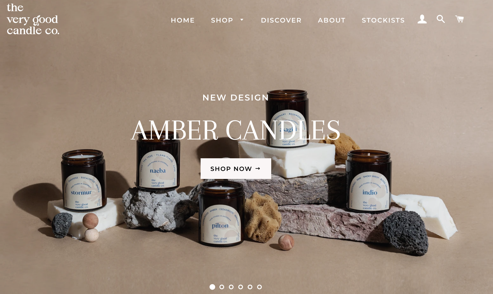

# Procesverslag
**Auteur:** -Olico Matsjitadze-

Markdown cheat cheet: [Hulp bij het schrijven van Markdown](https://github.com/adam-p/markdown-here/wiki/Markdown-Cheatsheet). Nb. de standaardstructuur en de spartaanse opmaak zijn helemaal prima. Het gaat om de inhoud van je procesverslag. Besteedt de tijd voor pracht en praal aan je website.

## Bronnenlijst
1. -bron 1-
2. -bron 2-
3. -...-

## Eindgesprek (week 7/8)

-dit ging goed & dit was lastig-

**Screenshot(s):**

-screenshot(s) van je eindresultaat-

## Voortgang 3 (week 6)

-same as voortgang 1-

## Voortgang 2 (week 5)

-same as voortgang 1-

## Voortgang 1 (week 3)

De typografie opdrachten heb ik alle drie afgekregen en het was even puzzelen met de code. Als een 4de typografie opdracht heb ik gespeeld met de gradient van de tekst. Ik heb met deze opdrachten veel geleerd en het coderen per opdracht ging mij een stuk makkelijker af. Ik vind nog wel de link tussen HTML en CSS soms verwarrend. Daarbij bedoel ik vooral de Selectoren in CSS.

**Screenshot(s):**

-screenshot(s) van hoe ver je bent met korte uitleg-

Vragen voor de Meeting:
- Hoe zorg ik ervoor dat ik per zin minder woorden heb? Moet ik hiervoor html gebruiken of is CSS genoeg?
- Is werken met -webkit-background de beste manier om een gradient van een woord aan te passen?

### Verslag van meeting

-na afloop snel uitkomsten vastleggen-

## Breakdownschets + Typografie (week 1)

## Intake (week 1)
-uitwerken voor de kick-off werkgroep - begin van de eerste week-

**Je startniveau:** blauw

**Je focus:** surface plane

**Je opdracht:** Het namaken van een bestaande website: https://theverygoodcandlecompany.com/

**Screenshot(s) van de eerste pagina (small screen):**

**Screenshot(s) van de tweede pagina (small screen):**

