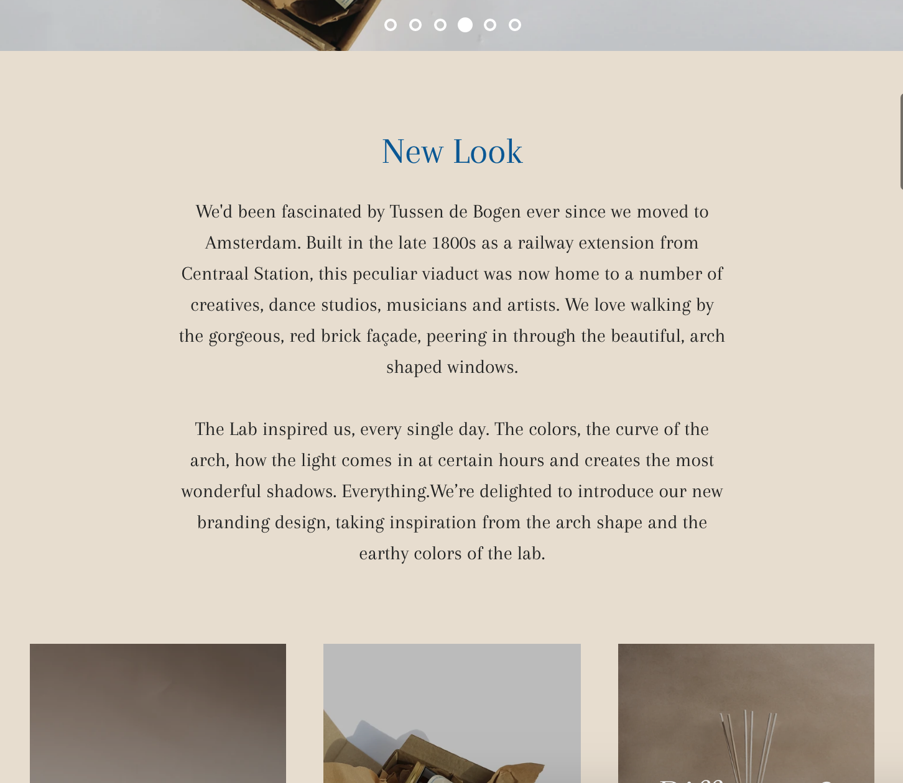

# Procesverslag
**Auteur:** -Olico Matsjitadze-

Markdown cheat cheet: [Hulp bij het schrijven van Markdown](https://github.com/adam-p/markdown-here/wiki/Markdown-Cheatsheet). Nb. de standaardstructuur en de spartaanse opmaak zijn helemaal prima. Het gaat om de inhoud van je procesverslag. Besteedt de tijd voor pracht en praal aan je website.

## Bronnenlijst
1. Landing Pagina - https://theverygoodcandlecompany.com/
2. About Pagina - https://theverygoodcandlecompany.com/pages/about
3. Alle foto's bevinden zich op de website van https://theverygoodcandlecompany.com/

## Eindgesprek (week 7/8)

-dit ging goed & dit was lastig-

**Screenshot(s):**

-screenshot(s) van je eindresultaat-
## Na Kerstvakantie

De website ziet er goed uit en werkt naar behoren, ik heb wel classes gebruikt, maar vond het lastig om deze te vervangen..

## Kerstvakantie
Ik heb voornamelijk gewerkt om mijn website responsive mogelijk te krijgen met media Queries. De mobiele versie ziet er beter uit. Ik heb als advies gekregen om de media quaries in een aparte file te maken. Zodat alles overzichtelijker is

## Voortgang 3 (week 6)

Tijdens mijn voortgang ben ik erachter gekomen dat ik teveel classes gebruik. Ik moet deze dus zo veel mogelijk weghalen. Ook probeer ik grids te verwerken in mijn code maar dat is vrij lastig. Ik ga vooral in de kerstvakantie aan mijn code werken, zodat alles er CLEAN uitziet met zo min mogelijk classes. Ook ga ik in de vakantie werken aan het responsive maken van de About pagina en de landing pagina met Media Queries. Ik ga ook tutorials bekijken van Javascript en hoe ik de micro-interactie in de website kan verwerken. 

## Voortgang 2 (week 5)

Week (4): Flexbox. Ik heb de video's allemaal bekeken en aantekeningen opgeschreven, maar ben nog bezig met het oefenen hiervan. Doordat ik de landingpagina van de website wat lastiger vind ga ik eerst werken aan "de about" pagina. Ik ben hier voornamelijk mijn skills van flexbox aan het oefenenen. Ook heb ik een begin gemaakt aan de footer.

## Voortgang 1 (week 3)

De typografie opdrachten heb ik alle drie afgekregen en het was even puzzelen met de code. Als een 4de typografie opdracht heb ik gespeeld met de gradient van de tekst. Ik heb met deze opdrachten veel geleerd en het coderen per opdracht ging mij een stuk makkelijker af. Ik vind nog wel de link tussen HTML en CSS soms verwarrend. Daarbij bedoel ik vooral de Selectoren in CSS.
Ik ben voornamelijk bezig geweest om de header van mijn website te verbeteren. Ik had soms nog moeite met flexbox en het ordenen van items. Ik krijg het wel langzaam meer onder de knie.

**Screenshot(s):**

### Verslag van meeting

Ik heb hulp van Deanna gekregen hoe ik het beste mijn header eruit kan laten zien met code, ze is erg behulpzaam geweest en heeft mij veel geholpen!

## Positionering (week 2)

Vrij lastige opdracht. Ik begrijp nog steeds niet het verschil tussen relative en absolute. Waarom kan ik het roze blokje niet groter maken met right: 10; etc. Vind dit nog verwarrend.

## Breakdownschets + Typografie (week 1)

De typografie opdrachten heb ik alle drie afgekregen en het was even puzzelen met de code. Als een 4de typografie opdracht heb ik gespeeld met de gradient van de tekst. Ik heb met deze opdrachten veel geleerd en het coderen per opdracht ging mij een stuk makkelijker af. Ik vind nog wel de link tussen HTML en CSS soms verwarrend. Daarbij bedoel ik vooral de Selectoren in CSS.

**Vragen voor de Meeting**
- Hoe zorg ik ervoor dat ik per zin minder woorden heb? Moet ik hiervoor html gebruiken of is CSS genoeg?
- Is werken met -webkit-background de beste manier om een gradient van een woord aan te passen?

**Screenshot(s):**

## Intake (week 1)

**Je startniveau:** blauw

**Je focus:** surface plane

**Je opdracht:** Het namaken van een bestaande website: https://theverygoodcandlecompany.com/

**Screenshots Small Screen van Website:**

